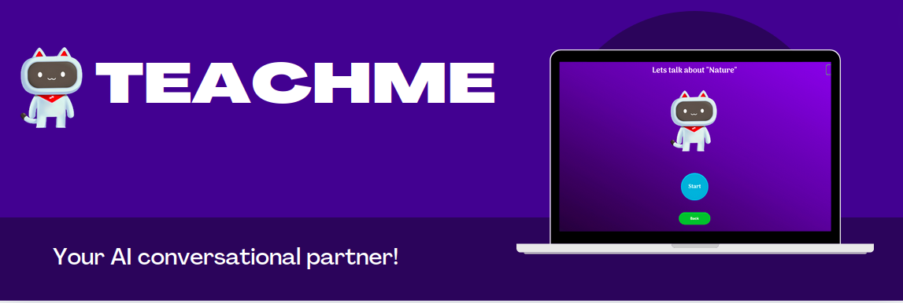
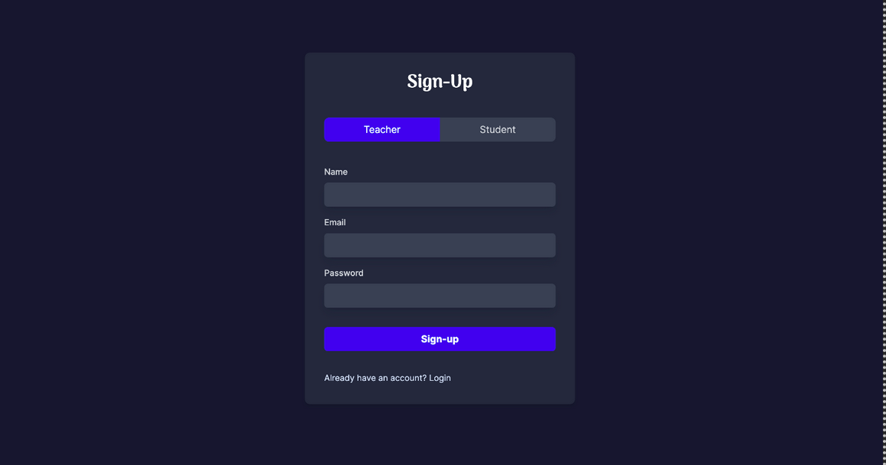
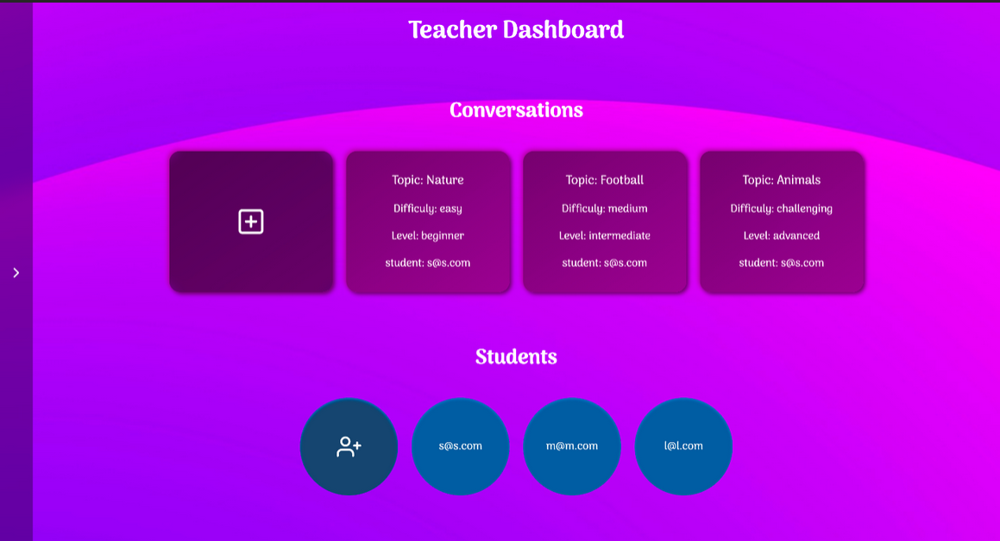
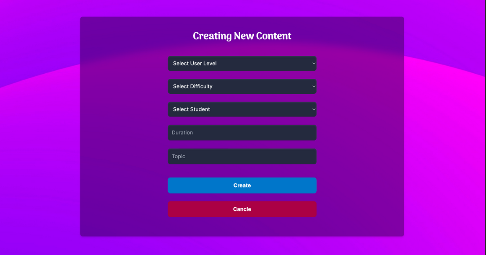
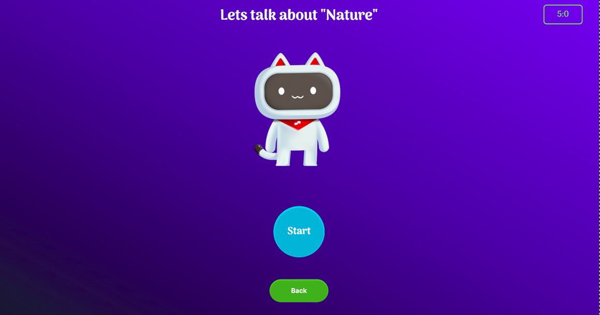
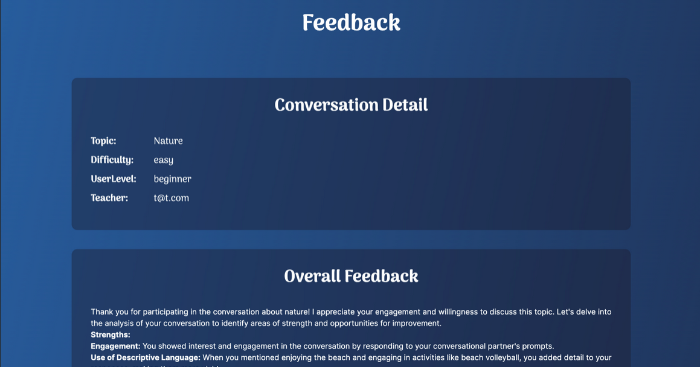
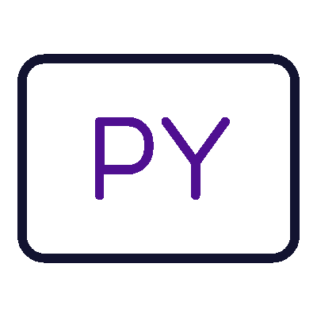
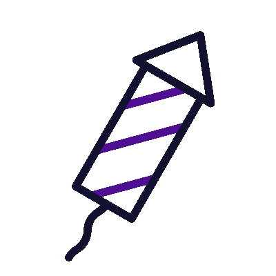
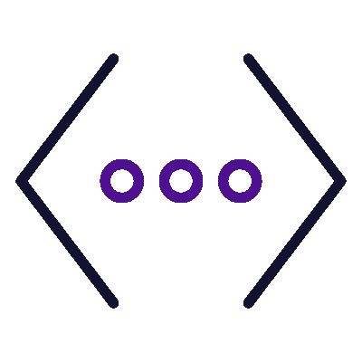

<div align="center">

  
  <h1>TeachMe</h1>
  
  <p>
    Your favorite english conversational partner.
  </p>
  
  
<!-- Badges -->
<p>
  <a href="https://github.com/itsPeetah/polimi-mdproject-2024-teachme/graphs/contributors">
    
  </a>
  <a href="">
    
  </a>
  <a href="https://github.com/itsPeetah/polimi-mdproject-2024-teachme/network/members">
    
  </a>
  <a href="https://github.com/itsPeetah/polimi-mdproject-2024-teachme/stargazers">
    
  </a>
  <a href="https://github.com/itsPeetah/polimi-mdproject-2024-teachme/issues/">
    
  </a>
  <a href="https://github.com/itsPeetah/polimi-mdproject-2024-teachme/blob/master/LICENSE">
    
  </a>
</p>
   
<h4>
    <a href="https://github.com/itsPeetah/polimi-mdproject-2024-teachme/">View Demo</a>
  <span> · </span>
    <a href="https://github.com/itsPeetah/polimi-mdproject-2024-teachme/wiki">Documentation</a> <!-- TODO: Update with deliverables folder when ready -->
  <span> · </span>
    <a href="https://github.com/itsPeetah/polimi-mdproject-2024-teachme/wiki">Wiki</a>
  <span> · </span>
    <a href="https://github.com/itsPeetah/polimi-mdproject-2024-teachme/issues">Request Feature / Report bug</a>
  </h4>
</div>

<br />

<!-- Table of Contents -->
# :notebook_with_decorative_cover: Table of Contents

- [About the Project](#star2-about-the-project)
  * [Team Members](#busts_in_silhouette-team-members)
  * [Screenshots](#camera-screenshots)
  * [Tech Stack](#space_invader-tech-stack)
  * [Features](#dart-features)
  * [Environment Variables](#key-environment-variables)
- [Getting Started](#toolbox-getting-started)
  * [Prerequisites](#bangbang-prerequisites)
  * [Installation](#gear-installation)
  * [Run Locally](#rocket-run-locally)
  * [Deployment](#triangular_flag_on_post-deployment)
- [Roadmap](#compass-roadmap)
- [FAQ](#grey_question-faq)
- [Resources](#books-resources)
- [Contact](#handshake-contact)

  

<!-- About the Project -->
## :star2: About the Project
Second language acquisition (SLA) is a complex process influenced by several factors, including motivation, learning environment, and practice opportunities. Traditional SLA methods often lack sufficient opportunities for interactive conversation practice, which is crucial for fluency development. 

TEACHme aims to address these challenges by providing accessible and cost-effective conversational practice opportunities. The system will utilize Large Language Models (LLMs) embedded in embodied agents to facilitate language learning, specifically targeting Italian native speakers learning English. 

## :busts_in_silhouette: Team Members
|              Name             |               Email                     |                        Github profiles                             |
|:-----------------------------:|:---------------------------------------:|:------------------------------------------------------------------:|
| Andrea Federici               | <andrea3.federici@mail.polimi.it>       | [][andrea-github]  |
| Alireza Yahyanejad            | <alireza.yahyanejad@mail.polimi.it>     | [][alireza-github] |
| Mahdi Valadan                 | <mohammadmahdi.valadan@mail.polimi.it>  | [][mahdi-github]   |
| Paolo Pertino                 | <paolo.pertino@mail.polimi.it>          | [][paolo-github]   |
| Pietro Moroni                 | <pietroguglielmo.moroni@mail.polimi.it> | [][pietro-github]  |


<!-- Screenshots -->
### :camera: Screenshots

<div align="center"> 
  
</div>

||
|:-:|:-:|:-:|
||

<!-- TechStack -->
### :space_invader: Tech Stack

<details>
  <summary>Client</summary>
  <ul>
    <li><a href="https://nextjs.org/">Next.js</a></li>
    <li><a href="https://reactjs.org/">React.js</a></li>
    <li><a href="https://azure.microsoft.com/en-us/products/ai-services/text-to-speech">Azure Text-to-Speech</a></li>
    <li><a href="https://learn.microsoft.com/sr-cyrl-rs/azure/ai-services/Speech-Service/how-to-speech-synthesis-viseme?tabs=visemeid&pivots=programming-language-csharp">Viseme for phoneme frame data generation</a></li>
    <li><a href="https://developer.mozilla.org/en-US/docs/Web/API/Canvas_API">HTML5 Canvas API</a></li>
  </ul>
</details>

<details>
  <summary>Server</summary>
  <ul>
    <li><a href="https://www.python.org/">Python 3</a></li>
    <li><a href="https://flask.palletsprojects.com/en/3.0.x/">Flask</a></li>
    <li><a href="https://openai.com/index/openai-api/">OpenAI API</a></li>
    <li><a href="https://python.langchain.com/v0.2/docs/introduction/">Langchain</a></li>
  </ul>
</details>

<details>
<summary>Database</summary>
  <ul>
    <li><a href="https://www.mongodb.com/">MongoDB</a></li>
  </ul>
</details>

<details>
<summary>Misc</summary>
  <ul>
    <li><a href="https://www.mongodb.com/products/platform/atlas-database">MongoDB Atlas</a></li>
    <li><a href="https://www.postman.com/">Postman</a></li>
  </ul>
</details>

<!-- Features -->
### :dart: Features
Teachers have the following functionalities:
- Register/login to the platform
- Create conversation rooms and invite students to join them.
- Customize the register, topic, time limits of the activity, and level of difficulty of conversation agents to ensure they are tailored to the students needs.
- Track their students' activities and visualize the conversations they are engaging with on the platform.

Students have the following functionalities:
- Register/login to the platform
- Join conversation rooms created by teachers and assigned to them.
- Engage in conversations with the conversational agents.
- Receive feedback on their performance during a specific conversation.
- Visualize their conversation history.

<!-- Env Variables -->
### :key: Environment Variables

To run this project, you will need to add the following environment variables to your .env file inside the **backend folder**:

```env
OPENAI_API_KEY=<YOUR OPENAI API KEY>
MONGODB_URI=<YOUR MONGODB ATLAS URI>
```

For running the frontend you will need to add the following environment variables to your .env.local file inside the root directory of the repository:

```env
NEXT_PUBLIC_SPEECH_KEY=<YOUR AZURE TTS API KEY>
NEXT_PUBLIC_SPEECH_REGION='westeurope'
```
<!-- Getting Started -->
## 	:toolbox: Getting Started

<!-- Prerequisites -->
### :bangbang: Prerequisites
This project runs on a Node.js environment. Make sure you have Node.js installed on your machine. You can install it from [here][node-link].
Moreover it uses `npm` as package manager. The application is built using `Next.js`. If you don't have `npm` installed, you can install it from [here][npm-link]. If you don't have `Next.js` installed, you can follow the installation instructions [here][next-link].

Regarding the backend, it is built using `Python 3`. You can install it from [here][python-link]. It uses `pip` packet manager. You can install it following the guide [here][pip-link].


<!-- Installation -->
### :gear: Installation

The full installation guide can be found in the wiki of the project.

|                          Frontend installation                                    |                             Backend installation                               |
|:---------------------------------------------------------------------------------:|:------------------------------------------------------------------------------:|
| [][frontend-installation-link] | [][backend-installation-link] |

<!-- Run Locally -->
### :rocket: Run Locally

|                                   |                                                                             |
|:---------------------------------:|:---------------------------------------------------------------------------:|
| [][running-link] | Find the instructions to run the project locally in the wiki of the project. |


<!-- Deployment -->
### :triangular_flag_on_post: Deployment

The deployment of the project is not yet available. 

<!-- Roadmap -->
## :compass: Roadmap

|         Feature name          |                                                    Description                                                        | Status |
|:------------------------------|:----------------------------------------------------------------------------------------------------------------------|:------:|
|    Registration and Login     | Users, students and teachers, must sign up and log into the platform to use it                                       |   ✅   |
| Teacher conversation creation | Teachers can create conversations specifying topic, difficulty, and length                                            |   ✅   |
| Student and teacher dashboard | Students and teachers have a dashboard containing the conversations they created/have been assigned respectively      |   ✅   |
|        Speech-to-text         | Speech-to-text functionality to transcribe the user's speech during the conversation                                  |   ✅   |
|      Conversational Agent     | LLM implementation for handling the conversation between students and conversational partner                          |   ✅   |
|        Text-to-speech         | Text-to-speech functionality for allowing the conversational partner to speak                                         |   ✅   |
|   Viseme for facial position  | The artificial agent must look like an avatar and make reasonable mouth movements while talking according to visemes  |   ✅   |
|   Post-conversation feedback  | Once a conversation has ended, the platform must provide feedback to students regarding the conversation itself       |   ✅   |
|  Post-conversation challenges | The platform must provide additional challenges (synonyms, pronunciation, ...) to students once the conversation ends |   ✅   |
|          Pilot-test           | Test the system and its functionalities with external people                                                          |   ❌   |
|          Final report         | Write the final report of the project                                                                                 |   ❌   |
|         Deployment           | Deploy the platform on a cloud service                                                                                 |   ❌   |
> **_KEY:_** [✅]() Done [❌]() Not done yet

<!-- FAQ -->
## :grey_question: FAQ

<details>
  <summary>Which language models are used in the project?</summary>
  <ul>
    <li>We leverage OpenAI's GPT-3.5 model for generating conversational responses. feedbacks and challenges. The chatbot structure has been defined using the Langchain library so that other solutions can be easily integrated over the existing one in the future. </li>
  </ul>
</details>

<details>
  <summary>Why are the endpoints in the backend not properly secured?</summary>
  <ul>
    <li>The project is a prototype and the focus was on the conversational agent and the interaction with the user. The backend is a simple Flask server that serves the front end and handles the conversation with the OpenAI API and other conversation-related features. For a production-ready version, a more secure authentication system should be implemented to handle correctly both the user data and the privileges to perform certain requests. </li>
  </ul>
</details>

<!-- Resources -->
## :books: Resources
|                            Code                              |                                 Wiki                         |                                 Report                           | 
|:------------------------------------------------------------:|:------------------------------------------------------------:|:----------------------------------------------------------------:|
| [][code-link] | [][wiki-link] | [][report-link] |

<!-- Contact -->
## :handshake: Contact

You can contact us by email. You can find all the information regarding our contacts in the [:busts_in_silhouette: Team Members](#busts_in_silhouette-team-members) section.

Project Link: [https://github.com/itsPeetah/polimi-mdproject-2024-teachme][project-link]


<!-- Links -->
[frontend-installation-logo]: ./assets/frontend_icon.gif
[frontend-installation-link]: https://github.com/itsPeetah/polimi-mdproject-2024-teachme/wiki/Installation#front-end
[backend-installation-logo]: ./assets/python_icon.gif
[backend-installation-link]: https://github.com/itsPeetah/polimi-mdproject-2024-teachme/wiki/Installation#back-end
[running-logo]: ./assets/run_icon.gif
[running-link]: https://github.com/itsPeetah/polimi-mdproject-2024-teachme/wiki/Running
[report-logo]: ./assets/report_logo.gif
[report-link]: https://www.google.com/
[wiki-logo]: ./assets/wiki_logo.gif
[wiki-link]: https://github.com/itsPeetah/polimi-mdproject-2024-teachme/wiki/
[code-logo]: ./assets/code_logo.gif
[code-link]: https://github.com/itsPeetah/polimi-mdproject-2024-teachme
[github-logo]: ./assets/github_logo.png
[paolo-github]: https://github.com/paolopertino
[andrea-github]: https://github.com/andrea-federici
[pietro-github]: https://github.com/itsPeetah
[mahdi-github]: https://github.com/MahdiValadan
[alireza-github]: https://github.com/yahyanejadalre
[project-link]: https://github.com/itsPeetah/polimi-mdproject-2024-teachme
[next-link]: https://nextjs.org/docs/getting-started/installation#automatic-installation
[pip-link]: https://pip.pypa.io/en/stable/installation/
[python-link]: https://www.python.org/downloads/
[node-link]: https://nodejs.org/
[npm-link]: https://docs.npmjs.com/downloading-and-installing-node-js-and-npm
