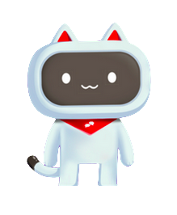
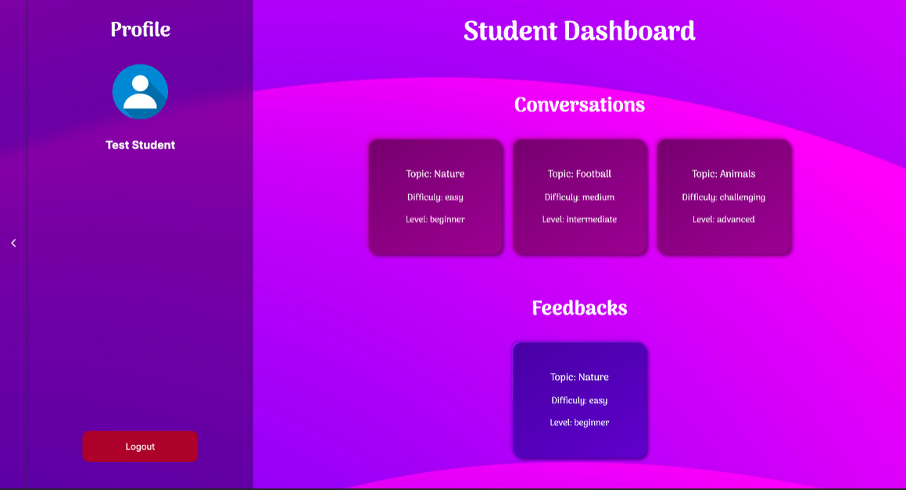

<div align="center">

  
  <h1>TeachMe</h1>
  
  <p>
    Your favorite english conversational partner.
  </p>
  
  
<!-- Badges -->
<p>
  <a href="https://github.com/itsPeetah/polimi-mdproject-2024-teachme/graphs/contributors">
    
  </a>
  <a href="">
    
  </a>
  <a href="https://github.com/itsPeetah/polimi-mdproject-2024-teachme/network/members">
    
  </a>
  <a href="https://github.com/itsPeetah/polimi-mdproject-2024-teachme/stargazers">
    
  </a>
  <a href="https://github.com/itsPeetah/polimi-mdproject-2024-teachme/issues/">
    
  </a>
  <a href="https://github.com/itsPeetah/polimi-mdproject-2024-teachme/blob/master/LICENSE">
    
  </a>
</p>
   
<h4>
    <a href="https://github.com/itsPeetah/polimi-mdproject-2024-teachme/">View Demo</a>
  <span> · </span>
    <a href="https://github.com/itsPeetah/TasteIt/blob/main/documentation/tasteit_report.pdf">Documentation</a>
  <span> · </span>
    <a href="https://github.com/itsPeetah/polimi-mdproject-2024-teachme/issues/">Report Bug</a>
  <span> · </span>
    <a href="https://github.com/itsPeetah/polimi-mdproject-2024-teachme/issues">Request Feature</a>
  </h4>
</div>

<br />

<!-- Table of Contents -->
# :notebook_with_decorative_cover: Table of Contents

- [About the Project](#-about-the-project)
  * [Team Members](#-team-members)
  * [Screenshots](#-screenshots)
  * [Tech Stack](#-tech-stack)
  * [Features](#-features)
  * [Environment Variables](#-environment-variables)
- [Getting Started](#toolbox-getting-started)
  * [Prerequisites](#bangbang-prerequisites)
  * [Installation](#gear-installation)
  * [Run Locally](#running-run-locally)
  * [Deployment](#triangular_flag_on_post-deployment)
- [Usage](#eyes-usage)
- [Roadmap](#compass-roadmap)
- [FAQ](#grey_question-faq)
- [License](#warning-license)
- [Contact](#handshake-contact)

  

<!-- About the Project -->
## :star2: About the Project
Second language acquisition (SLA) is a complex process influenced by several factors, including motivation, learning environment, and practice opportunities. Traditional SLA methods often lack sufficient opportunities for interactive conversation practice, which is crucial for fluency development. 

TEACHme aims to address these challenges by providing accessible and cost-effective conversational practice opportunities. The system will utilize Large Language Models (LLMs) embedded in embodied agents to facilitate language learning, specifically targeting Italian native speakers learning English. 

## :busts_in_silhouette: Team Members
|              Name             |             Email                 |
|:-----------------------------:|:---------------------------------:|
| Andrea Federici               | andrea.federici@mail.polimi.it    |
| Alireza Yahyanejad            | alireza.yahyanejad@mail.polimi.it | 
| Mahdi Valadan                 | mahdi.valadan@mail.polimi.it      |
| Paolo Pertino                 | paolo.pertino@mail.polimi.it      |
| Pietro Moroni                 | pietro.moroni@mail.polimi.it      |


<!-- Screenshots -->
### :camera: Screenshots

<div align="center"> 
  
</div>

||
|:-:|:-:|:-:|
||

<!-- TechStack -->
### :space_invader: Tech Stack

<details>
  <summary>Client</summary>
  <ul>
    <li><a href="https://nextjs.org/">Next.js</a></li>
    <li><a href="https://reactjs.org/">React.js</a></li>
    <li><a href="https://azure.microsoft.com/en-us/products/ai-services/text-to-speech">Azure Text-to-Speech</a></li>
    <li><a href="https://learn.microsoft.com/sr-cyrl-rs/azure/ai-services/Speech-Service/how-to-speech-synthesis-viseme?tabs=visemeid&pivots=programming-language-csharp">Viseme for phoneme frame data generation</a></li>
    <li><a href="https://developer.mozilla.org/en-US/docs/Web/API/Canvas_API">HTML5 Canvas API</a></li>
  </ul>
</details>

<details>
  <summary>Server</summary>
  <ul>
    <li><a href="https://www.python.org/">Python 3</a></li>
    <li><a href="https://flask.palletsprojects.com/en/3.0.x/">Flask</a></li>
    <li><a href="https://openai.com/index/openai-api/">OpenAI API</a></li>
    <li><a href="https://python.langchain.com/v0.2/docs/introduction/">Langchain</a></li>
  </ul>
</details>

<details>
<summary>Database</summary>
  <ul>
    <li><a href="https://www.mongodb.com/">MongoDB</a></li>
  </ul>
</details>

<details>
<summary>Misc</summary>
  <ul>
    <li><a href="https://www.mongodb.com/products/platform/atlas-database">MongoDB Atlas</a></li>
    <li><a href="https://www.postman.com/">Postman</a></li>
  </ul>
</details>

<!-- Features -->
### :dart: Features
Teachers have the following functionalities:
- Register/login to the platform
- Create conversation rooms and invite students to join them.
- Customize the register, topic, time limits of the activity, and level of difficulty of conversation agents to ensure they are tailored to the students needs.
- Track their students' activities and visualize the conversations they are engaging with on the platform.

Students have the following functionalities:
- Register/login to the platform
- Join conversation rooms created by teachers and assigned to them.
- Engage in conversations with the conversational agents.
- Receive feedback on their performance during a specific conversation.
- Visualize their conversation history.

<!-- Env Variables -->
### :key: Environment Variables

To run this project, you will need to add the following environment variables to your .env file inside the **backend folder**:

```
OPENAI_API_KEY=<YOUR OPENAI API KEY>
MONGODB_URI=<YOUR MONGODB ATLAS URI>
```

For running the frontend you will need to add the following environment variables to your .env file inside the **frontend folder**:

```
NEXT_PUBLIC_SPEECH_KEY=<YOUR AZURE TTS API KEY>
```
<!-- Getting Started -->
## 	:toolbox: Getting Started

<!-- Prerequisites -->
### :bangbang: Prerequisites

This project uses Yarn as package manager

```bash
 npm install --global yarn
```

<!-- Installation -->
### :gear: Installation

Install my-project with npm

```bash
  yarn install my-project
  cd my-project
```

<!-- Run Locally -->
### :running: Run Locally

Clone the project

```bash
  git clone https://github.com/Louis3797/awesome-readme-template.git
```

Go to the project directory

```bash
  cd my-project
```

Install dependencies

```bash
  yarn install
```

Start the server

```bash
  yarn start
```


<!-- Deployment -->
### :triangular_flag_on_post: Deployment

To deploy this project run

```bash
  yarn deploy
```


<!-- Usage -->
## :eyes: Usage

Use this space to tell a little more about your project and how it can be used. Show additional screenshots, code samples, demos or link to other resources.


```javascript
import Component from 'my-project'

function App() {
  return <Component />
}
```

<!-- Roadmap -->
## :compass: Roadmap

* [x] Requirement analysis
* [x] Design
* [x] MVP implementation
* [ ] Testing with real users
* [ ] Deployment

<!-- FAQ -->
## :grey_question: FAQ

- Which language models are used in the project?

  + We leverage OpenAI's GPT-3.5 model for generating conversational responses. feedbacks and challenges. The chatbot structure has been defined using the Langchain library, so that other solutions can be easily integrated over the existing one in the future. 

- Why are the endpoints in the backend not properly secured?

  + The project is a prototype and the focus was on the conversational agent and the interaction with the user. The backend is a simple Flask server that serves the frontend and handles the conversation with the OpenAI API and other conversation-related features. For a production-ready version, a more secure authentication system should be implemented to handle correctly both the user data and the privileges to perform certain requests.

<!-- Contact -->
## :handshake: Contact

You can contact us by email. You can find all the information regarding our contacts in the [:busts_in_silhouette: Team Members](#-team-members) section.

Project Link: [https://github.com/itsPeetah/polimi-mdproject-2024-teachme](https://github.com/itsPeetah/polimi-mdproject-2024-teachme)
